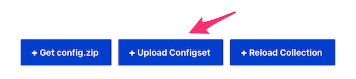

[](https://addons.ddev.com)
[](https://github.com/ddev/ddev-solr/actions/workflows/tests.yml?query=branch%3Amain)
[](https://github.com/ddev/ddev-solr/commits)
[](https://github.com/ddev/ddev-solr/releases/latest)

# DDEV Solr <!-- omit in toc -->

- [Overview](#overview)
- [Installation](#installation)
- [Usage](#usage)
  - [Solr Admin credentials](#solr-admin-credentials)
  - [Changing Solr password](#changing-solr-password)
  - [Create a collection](#create-a-collection)
  - [Solr command line client](#solr-command-line-client)
- [Advanced Customization](#advanced-customization)
  - [Using alternate versions of Solr](#using-alternate-versions-of-solr)
  - [Add third party Solr modules and libraries](#add-third-party-solr-modules-and-libraries)
- [Solarium](#solarium-php-client)
- [Drupal and Search API Solr](#drupal-and-search-api-solr)
    - [Installation steps](#installation-steps)
- [What's the difference between this and ddev-drupal-solr](#whats-the-difference-between-this-and-ddev-drupal-solr)
- [Credits](#credits)

## Overview

[Apache Solr](https://solr.apache.org/) is the blazing-fast, open source, multi-modal search platform built on the full-text, vector, and geospatial search capabilities of Apache Lucene™.

This add-on integrates Solr (Cloud) into your [DDEV](https://ddev.com/) project using a single Solr node, which is sufficient for local development requirements.

> [!NOTE]
> Existing applications that have been developed with Solr Standalone instead of
> Cloud should still work with Cloud. They connect to a __collection__ instead a
> __core__ but they should not notice that.

## Installation

```bash
ddev add-on get ddev/ddev-solr
ddev restart
```

After installation, make sure to commit the `.ddev` directory to version control.

## Usage

| Command | Description |
| ------- | ----------- |
| `ddev solr-admin` | Open Solr Admin in your browser (`https://<project>.ddev.site:8943`) |
| `ddev solr` | Run Solr CLI inside the Solr container |
| `ddev solr-zk` | Run Solr ZooKeeper inside the Solr container |
| `ddev describe` | View service status and used ports for Solr |
| `ddev logs -s solr` | Check Solr logs |

### Solr Admin credentials

Solr Cloud provides a lot of APIs to manage your collections, cores, schemas
etc. Some of these APIs require a so-called "trusted" context. Solr therefore
supports different technologies for authentication and authorization. The
easiest one to configure is "Basic Authentication". This DDEV service comes with
a simple pre-configured [`security.json`](solr/security.json) to provide such a trusted context based on basic authentication. It creates a single administrative account having full access rights:

| Field    | Value       |
|----------|-------------|
| Username | `solr`      |
| Password | `SolrRocks` |

To access the Solr container from DDEV's web container, use `http://solr:8983`.

### Changing Solr password

To change the Solr admin password (e.g. to `SolrRocksSolrRocks`):

1. In `.ddev/docker-compose.solr.yaml`, remove the `#ddev-generated` line. Update the password in both `dockerfile_inline` and `SOLR_AUTHENTICATION_OPTS`:

    ```diff
    -#ddev-generated
    services:
      solr:
        build:
          dockerfile_inline: |
            ...
            # Use predefined values for username/password in Solr Admin UI.
    -       RUN sed -i "/\$$rootScope.exceptions = {};/a \$$scope.username = 'solr'; \$$scope.password = 'SolrRocks';" /opt/solr/server/solr-webapp/webapp/js/angular/controllers/login.js
    +       RUN sed -i "/\$$rootScope.exceptions = {};/a \$$scope.username = 'solr'; \$$scope.password = 'SolrRocksSolrRocks';" /opt/solr/server/solr-webapp/webapp/js/angular/controllers/login.js
        ...
        environment:
          ...
    -     SOLR_AUTHENTICATION_OPTS: -Dbasicauth=solr:SolrRocks
    +     SOLR_AUTHENTICATION_OPTS: -Dbasicauth=solr:SolrRocksSolrRocks
          ...
    ```

2. In `.ddev/solr/security.json`, remove the `#ddev-generated` line and replace the hashed password string. You can generate a new one using tools like [clemente-biondo.github.io](https://github.com/clemente-biondo/clemente-biondo.github.io):

```diff
{
- "#ddev-generated":true,
  "authentication":{
    "class":"solr.BasicAuthPlugin",
    "credentials":{
-     "solr":"IV0EHq1OnNrj6gvRCwvFwTrZ1+z1oBbnQdiVC3otuq0= Ndd7LKvVBAaZIF0QAVi1ekCfAJXr1GGfLtRUXhgrF8c="
+     "solr":"9MCwAcWQZyUKRY1AUuemHRws4/PIqtwjrpw3D4GCQHo= dGszejkxYm0yYTVuNzBuZQ=="
    },
    "blockUnknown":false
  },
  ...
```

3. Run:

    ```bash
    ddev stop && ddev debug rebuild -s solr && ddev start
    ```

## Create a collection

Creating collections require that the configset to be used by this collection
has been uploaded within a "trusted context". This is ensured if you use the
admin UI with the predefined admin account `solr` or if you use the solr command
line client `ddev solr-zk`. If you use any other http client and the API, ensure
that you use basic authentocation with the prconfigured admin account
`solr:SolrRocks`.

The PHP solarium library provides all required methods as well.
Some frameworks like Drupal provide a full integration to manage your Solr
collections within the framework itself.

For backward compatibility to older ddev Solr integrations and legacy
applications that just provide a Solr configset (sometimes simply called
"Solr config"), there's a ddev specific convenient method, too:
Simply copy a configset directory to `.ddev/solr/configsets/` and restart ddev.
That configset will automatically be uploaded (or updated) to Solr using a
trusted context and a corresponding collection with the same name will be
created if it doesn't exist already.

> [!NOTE]
> Solr Cloud could be run on multiple nodes. Any node has its own core
> that holds your data. A collection is a set of cores distributed over several
> nodes. If you read some old documentation or the usage instruction of an old PHP
> application, it might talk about a "core". In that case you could simply replace
> the word "core" with "collection". Connecting to a collection on Solr Cloud
> behaves like connecting to a core on "Solr standalone".
> Some documentations or applications talk about an "index". That's also just a
> synonym for a collection.

> [!NOTE]
> For maximum compatibility with older applications that don't support
> basic authentication when connecting Solr, reading/searching from and updating
> documents within an "index" (collection) doesn't require basic authentication
> using this ddev integration. For sure you can use basic authentication but it is
> not a must. Just the admin UI requires it to ensure the "trusted context".

## Solr command line client

The `solr` command line client is available as a `ddev` command:

```bash
ddev solr
```

The `zk` command is usually executed as `solr zk -z <HOST>:<PORT>`. To ease its
usage a convenient `ddev` command exists that uses preconfigured connection
settings. So the `-z` option can be omitted:

```bash
ddev solr-zk
```

Both commands are preconfigured to connect as user `solr` which is the admin account.

## Advanced Customization

### Using alternate versions of Solr

This addon defaults to installing a preferred version of the [docker Solr image](https://hub.docker.com/_/solr), but can be configured to use a different version via environment variable (`SOLR_BASE_IMAGE`).  For example, if you would like to install the latest Solr 8.11.x, follow the steps below:

```bash
# Change image version as appropriate.
ddev dotenv set .ddev/.env.solr --solr-base-image="solr:8.11"

ddev add-on get ddev/ddev-solr

# remove old solr volume (if this is downgrade)
ddev stop
docker volume rm ddev-$(ddev status -j | docker run -i --rm ddev/ddev-utilities jq -r '.raw.name')_solr

# rebuild solr image (required step)
ddev debug rebuild -s solr

ddev restart

# confirm the new Solr version (expect a value something like 8.11.4)
ddev solr version
```

Make sure to commit the `.ddev/.env.solr` file to version control.

All customization options (use with caution):

| Variable | Flag | Default |
| -------- | ---- | ------- |
| `SOLR_BASE_IMAGE` | `--solr-base-image` | `solr:9.6` |

### Add third party Solr modules and libraries

Copy third party Solr modules and libraries jar files into `.ddev/solr/lib/`.
To load and use them within a collection, add this line to your
collection's `solrconfig.xml`:
```xml
<lib dir="/opt/solr/modules/ddev/lib/" regex=".*\.jar" />
```

## Solarium PHP client

[Solarium](https://github.com/solariumphp/solarium) is the leading Solr
integration library for PHP. It is used by the modules and integrations of many
PHP frameworks and CMS like Drupal, Typo3, Wordpress, Symfony, Laravel, ...
If you build your own PHP application and want to use Solarium directly, here is
an example of how to configure the connection in DDEV.

```php
use Solarium\Core\Client\Adapter\Curl;
use Symfony\Component\EventDispatcher\EventDispatcher;

$adapter = new Curl();
$eventDispatcher = new EventDispatcher();
$config = [
    'endpoint' => [
        'localhost' => [
            // Replace <project> by your project's name:
            'host' => 'solr',
            'port' => 8983,
            'path' => '/',
            // Use your collection name here:
            'collection' => 'techproducts',
            'username' => 'solr',
            'password' => 'SolrRocks',
        )
    )
);

$client = new Solarium\Client($adapter, $eventDispatcher, $config);
```

## Drupal and Search API Solr

Solr Cloud is the \"modern\" (and simplest) way to run Solr.  You need to configure a Search API server using Solr as backend and `Solr Cloud with Basic Auth` as its connector. Specify the username "solr" and password "SolrRocks" which are the pre-configured credentials for Basic Authentication in `.ddev/solr/security.json`.

Solr requires a Drupal-specific configset for any collection to index Drupal's content. (In Solr Cloud "collections" are the equivalent to "cores" in classic Solr installations. Actually, in a big Solr Cloud installation a collection might consist of multiple cores across all Solr Cloud nodes.)


Starting from Search API Solr module version 4.2.1 you don't need to define collections or configsets so you can safely ignore the \"Create a collection\" section in this documentation . You simply enable the `search_api_solr_admin` submodule which is part of the [Search API Solr module](https://www.drupal.org/project/search_api_solr). Then you create or update your \"collections\" at any time by clicking the "Upload Configset" button on the Search API server details page or use `drush` to do this with

```bash
ddev drush --numShards=1 search-api-solr:upload-configset SEARCH_API_SERVER_ID
```

> [!NOTE]
> `SEARCH_API_SERVER_ID` is the machine name of your Search API server.The number of "shards" should always be "1" as this local installation only runs a single Solr node.

> [!TIP]
> Use `solr` rather than `localhost` for the name of the solr server in your search api configuration.  The Search API suggests `localhost` but that won't work with DDEV.

For step-by-step setup details with screenshots refer to [Drupal at your fingertips: Local Solr setup with Search API Solr](https://www.drupalatyourfingertips.com/development#local-solr-setup-with-search-api-solr).

### Installation steps

1. Enable the `search_api_solr_admin` module. (This submodule is included in Search API Solr >= 4.2.1)
2. Create a search server using the Solr backend and select `Solr Cloud with Basic Auth` as connector:
   - HTTP protocol: `http`
   - Solr node: `solr`
   - Solr port: `8983`
   - Solr path: `/`
   - Default Solr collection: `techproducts` (You can define any name here. The collection will be created automatically.)
   - Solr host context: `solr`
   - Username: `solr`
   - Password: `SolrRocks`
3. On the server's "view" page click the `Upload Configset` button and check the "Upload (and overwrite) configset" checkbox.

    

4. Set the number of shards to `1`.
5. Press `Upload`.

## What's the difference between this and ddev-drupal-solr

[`ddev-drupal-solr`](https://github.com/ddev/ddev-drupal-solr) provides Solr running in a the "classic standalone" mode using a single core. `ddev-solr` runs Solr in
the modern "cloud" mode (even if it just starts a single Solr node).

Running in cloud mode has several advantages. The biggest one from Drupal's perspective is that every time an update of
the `search_api_solr` module asks you to generate and deploy an updated configset, it is just a click in the UI or a
single `drush` command instead of downloading and extracting a zip, copying the files to the ddev folder and restarting
DDEV. This is possible because of the Configset API Solr Cloud provides.

But there are also more and more APIs and features, which are only available in combination with Solr Cloud and which
are supported by Solarium and `search_api_solr`:
   - [Streaming Expressions](https://solr.apache.org/guide/solr/latest/query-guide/streaming-expressions.html)
   - Collection API
   - Updating files like stop words, compound words, protected words, NLP models, LTR models, ... on the the fly using
     APIs
   - ...

Another important difference of `ddev-solr` compared to `ddev-drupal-solr` is, that ddev-solr configures Solr to be able to
handle NLP models. So DDEV could be used with [search_api_solr_nlp](https://www.drupal.org/project/search_api_solr_nlp).

`ddev-solr` supports third party Solr plugins/modules/libraries.

## Credits

**Contributed and maintained by [@mkalkbrenner](https://github.com/mkalkbrenner)**
